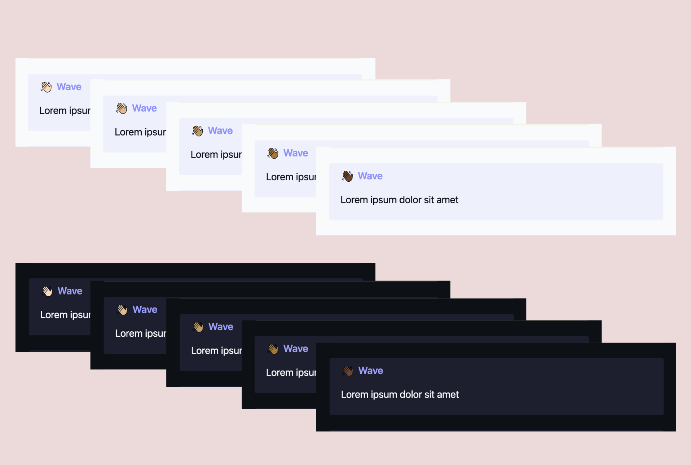
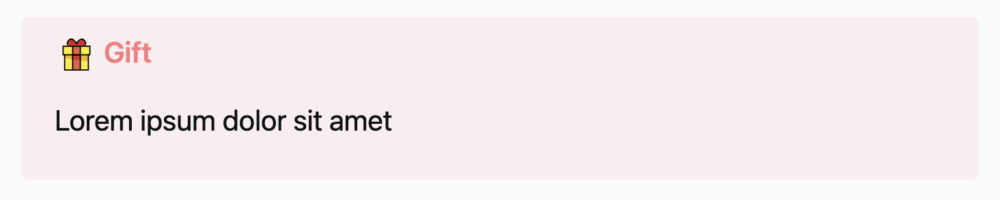
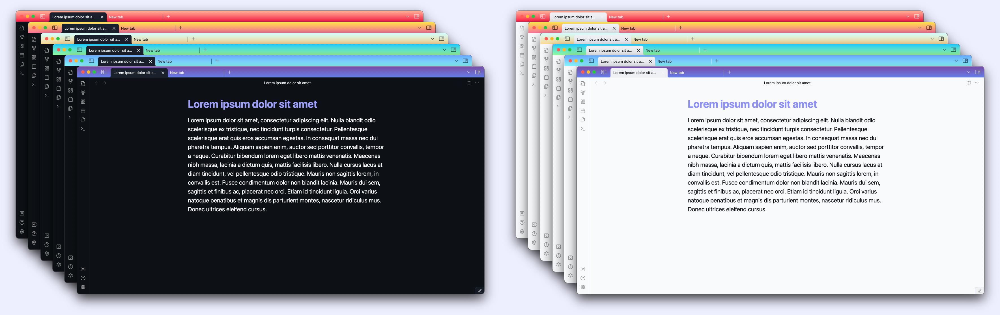

> [!tip]
> You can also check out the [Obsidian Prime theme](https://github.com/rivea0/obsidian-prime) as well, although you don't have to use the theme to use these snippets!

# Usage

Download (or copy) the CSS snippet you want to use, and add it to `.obsidian/snippets` folder inside your Obsidian vault.

Or, clone the repository to add all the snippets:

```
git clone git@github.com:rivea0/obsidian-prime-snippets.git

cp obsidian-prime-snippets/*.css <path/to/your/vault>/.obsidian/snippets
```

You can buy me a coffee to support my work:

<a href="https://www.buymeacoffee.com/rivea0"></a>


# Table of Contents

- [Snippets](#snippets)
  - [Callout Emojis](#callout-emojis)
    - [Usage](#callout-emojis-usage)
    - [List of emojis](#list-of-emojis)
      - [Activities](#activities)
      - [Animals & nature](#animals--nature)
      - [Food & drink](#food--drink)
      - [Objects](#objects)
      - [Symbols](#symbols)
      - [Travel & places](#travel--places)
      - [People & body](#people--body)
      - [Smileys & emotion](#smileys--emotion)
      - [Miscellaneous](#miscellaneous)
    - [Showcase](#showcase)
    - [Extending emojis](#extending-emojis)
  - [Gradient Frames](#gradient-frames)
    - [List of gradients](#list-of-gradients)
    - [Extending gradients](#extending-gradients)

# [Snippets](#snippets)

## [Callout Emojis](#callout-emojis)

Use emojis as callout icons, with skin tones!



_Note: you can use the [Obsidian Style Settings plugin](https://github.com/mgmeyers/obsidian-style-settings) to easily switch between skin tones._

### [Usage](#callout-emojis-usage)

In Obsidian, callouts can be created by giving a _type identifier_ such as `[!info]` to the first line of a blockquote such as:

```markdown
> [!info]
> Here's a callout block.
```

_See more at https://help.obsidian.md/Editing+and+formatting/Callouts._

Emoji names work just like type identifiers, so you can add, for example, `[!gift]` to display the gift emoji (🎁) as the icon:



### [List of emojis](#list-of-emojis)

##### [Activities](#activities)

- `jack-o-lantern`
- `christmas-tree`
- `fireworks`
- `sparkler`
- `firecracker`
- `sparkles`
- `balloon`
- `party`
- `confetti`
- `tanabata-tree`
- `pine-decoration`
- `japanese-dolls`
- `carp-streamer`
- `wind-chime`
- `moon-viewing`
- `red-envelope`
- `ribbon`
- `gift`
- `ribbon-2`
- `ticket`
- `trophy`
- `medal`
- `medal-1st`
- `medal-2nd`
- `medal-3rd`
- `soccer`
- `baseball`
- `softball`
- `basketball`
- `volleyball`
- `football`
- `rugby`
- `tennis`
- `flying-disc`
- `bowling`
- `lacrosse`
- `ping-pong`
- `badminton`
- `boxing`
- `goal-net`
- `flag-in-hole`
- `ice-skate`
- `fishing`
- `diving`
- `bullseye`
- `yo-yo`
- `kite`
- `crystal-ball`
- `magic-wand`
- `joystick`
- `joystick-2`
- `slot-machine`
- `puzzle`
- `teddy-bear`
- `chess-pawn`
- `joker`
- `palette`
- `thread`
- `picture`
- `yarn`
- `knot`

##### [Animals & nature](#animals--nature)

- `monkey`
- `dog`
- `wolf`
- `fox`
- `cat`
- `lion`
- `tiger`
- `horse`
- `moose`
- `unicorn`
- `cow`
- `pig`
- `mouse`
- `hamster`
- `rabbit`
- `bat`
- `bear`
- `panda`
- `chicken`
- `chick`
- `bird`
- `penguin`
- `dove`
- `swan`
- `owl`
- `feather`
- `flamingo`
- `peacock`
- `goose`
- `phoenix`
- `dragon`
- `dragon-2`
- `whale`
- `frog`
- `snake`
- `turtle`
- `fish`
- `fish-2`
- `coral`
- `jellyfish`
- `octopus`
- `butterfly`
- `beetle`
- `bee`
- `scorpion`
- `fly`
- `microbe`
- `bouquet`
- `lotus`
- `rose`
- `hibiscus`
- `sunflower`
- `flower`
- `tulip`
- `hyacinth`
- `seedling`
- `plant`
- `cactus`
- `tree`
- `palm-tree`
- `herb`
- `shamrock`
- `clover`
- `fall`
- `leaf`

##### [Food & drink](#food--drink)

- `grapes`
- `melon`
- `watermelon`
- `tangerine`
- `lemon`
- `lime`
- `banana`
- `pineapple`
- `mango`
- `apple`
- `apple-2`
- `pear`
- `peach`
- `cherries`
- `strawberry`
- `blueberries`
- `tomato`
- `coconut`
- `avocado`
- `eggplant`
- `potato`
- `carrot`
- `broccoli`
- `onion`
- `mushroom`
- `pepper`
- `croissant`
- `baguette`
- `pretzel`
- `pancakes`
- `cheese`
- `meat`
- `hamburger`
- `fries`
- `pizza`
- `taco`
- `egg`
- `cooking`
- `salad`
- `popcorn`
- `bento-box`
- `spaghetti`
- `ice-cream`
- `donut`
- `cupcake`
- `cake`
- `chocolate`
- `candy`
- `lollipop`
- `hot-drink`
- `teapot`
- `bottle`
- `cocktail`
- `beer`
- `cheers`
- `bubble-tea`
- `ice`
- `plate`
- `chopsticks`

##### [Objects](#objects)

- `jeans`
- `high-heels`
- `crown`
- `cap`
- `glasses`
- `gem`
- `megaphone`
- `bell`
- `drum`
- `guitar`
- `trumpet`
- `piano`
- `telephone`
- `battery`
- `low-battery`
- `search`
- `candle`
- `lightbulb`
- `book`
- `books`
- `bookmark`
- `dollar`
- `envelope`
- `paper`
- `note`
- `calendar`
- `chart`
- `scissors`
- `locked`
- `unlocked`
- `key`
- `shield`
- `gear`
- `magnet`
- `dna`
- `pill`
- `band-aid`
- `window`
- `soap`
- `bubbles`

##### [Symbols](#symbols)

- `warning`
- `prohibited`
- `no-entry`
- `peace`
- `infinity`
- `question`
- `exclamation`
- `recycle`
- `check`
- `cross`
- `circle-red`
- `circle-orange`
- `circle-yellow`
- `circle-green`
- `circle-blue`
- `circle-purple`
- `square-red`
- `square-orange`
- `square-yellow`
- `square-green`
- `square-blue`
- `square-purple`

##### [Travel & places](#travel--places)

- `globe-1`
- `globe-2`
- `globe-3`
- `globe`
- `compass`
- `beach`
- `desert`
- `classical`
- `wood`
- `house`
- `ferris-wheel`
- `car`
- `stop`
- `traffic`
- `anchor`
- `plane`
- `rocket`
- `ufo`
- `hourglass`
- `heat`
- `sun`
- `star`
- `moon`
- `planet`
- `cloud`
- `fog`
- `rainbow`
- `fire`
- `drop`
- `lightning`

##### [People & body](#people--body)

- `wave`
- `wave-light`
- `wave-medium-light`
- `wave-medium`
- `wave-medium-dark`
- `wave-dark`
- `hand`
- `hand-light`
- `hand-medium-light`
- `hand-medium`
- `hand-medium-dark`
- `hand-dark`
- `vulcan`
- `vulcan-light`
- `vulcan-medium-light`
- `vulcan-medium`
- `vulcan-medium-dark`
- `vulcan-dark`
- `v`
- `v-light`
- `v-medium-light`
- `v-medium`
- `v-medium-dark`
- `v-dark`
- `fingers-crossed`
- `fingers-crossed-light`
- `fingers-crossed-medium-light`
- `fingers-crossed-medium`
- `fingers-crossed-medium-dark`
- `fingers-crossed-dark`
- `point-left`
- `point-left-light`
- `point-left-medium-light`
- `point-left-medium`
- `point-left-medium-dark`
- `point-left-dark`
- `point-right`
- `point-right-light`
- `point-right-medium-light`
- `point-right-medium`
- `point-right-medium-dark`
- `point-right-dark`
- `point-down`
- `point-down-light`
- `point-down-medium-light`
- `point-down-medium`
- `point-down-medium-dark`
- `point-down-dark`
- `point-left`
- `point-left-light`
- `point-left-medium-light`
- `point-left-medium`
- `point-left-medium-dark`
- `point-left-dark`
- `thumbs-up`
- `thumbs-up-light`
- `thumbs-up-medium-light`
- `thumbs-up-medium`
- `thumbs-up-medium-dark`
- `thumbs-up-dark`
- `thumbs-down`
- `thumbs-down-light`
- `thumbs-down-medium-light`
- `thumbs-down-medium`
- `thumbs-down-medium-dark`
- `thumbs-down-dark`
- `raised-fist`
- `raised-fist-light`
- `raised-fist-medium-light`
- `raised-fist-medium`
- `raised-fist-medium-dark`
- `raised-fist-dark`
- `you`
- `you-light`
- `you-medium-light`
- `you-medium`
- `you-medium-dark`
- `you-dark`
- `clap`
- `clap-light`
- `clap-medium-light`
- `clap-medium`
- `clap-medium-dark`
- `clap-dark`
- `handshake`
- `handshake-light`
- `handshake-medium-light`
- `handshake-medium`
- `handshake-medium-dark`
- `handshake-dark`
- `eyes`
- `eye`
- `mouth`
- `tongue`

##### [Smileys & emotion](#smileys--emotion)

- `grin-1`
- `grin-2`
- `grin-3`
- `grin-4`
- `laugh-1`
- `laugh-2`
- `smile-1`
- `smile-2`
- `melt`
- `wink`
- `halo`
- `hearts-face`
- `heart-eyes`
- `starstruck`
- `kiss`
- `tongue-out`
- `shush`
- `think`
- `blush`
- `no-mouth`
- `neutral`
- `eyeroll`
- `grimace`
- `lying`
- `relieved`
- `sleep`
- `nausea`
- `vomit`
- `hot`
- `cold`
- `dead`
- `woozy`
- `mindblown`
- `celebrate`
- `sunglasses`
- `nerd`
- `frown`
- `astonished`
- `fear`
- `cry`
- `scream`
- `confused`
- `weary`
- `sweat`
- `tired`
- `angry`
- `devil`
- `skull-1`
- `skull-2`
- `poo`
- `clown`
- `ghost`
- `alien`
- `robot`
- `cat-grin`
- `cat-smile`
- `cat-laugh`
- `cat-heart-eyes`
- `cat-scream`
- `cat-cry`
- `see-no-evil`
- `hear-no-evil`
- `speak-no-evil`
- `kiss-mark`
- `letter`
- `heart-arrow`
- `heart-sparkles`
- `hearts`
- `heart-exclamation`
- `broken-heart`
- `heart-red`
- `heart-orange`
- `heart-yellow`
- `heart-green`
- `heart-blue`
- `heart-purple`
- `hundred`
- `collision`
- `speech`
- `thought`

##### [Miscellaneous](#miscellaneous)

- `flag`
- `iceberg`
- `first-aid`
- `location`
- `brain`
- `barcode`
- `qr`
- `shuttle`
- `pyramids`
- `interview`
- `filter`
- `trash`
- `comment`
- `red-jar`
- `blue-jar`
- `orange-jar`
- `yellow-jar`
- `green-jar`
- `purple-jar`
- `hacker-cat`

### Showcase

_See full showcase in [the wiki](https://github.com/rivea0/obsidian-prime-snippets/wiki/Callout-Emojis#showcase)._

### Extending emojis

You can add more emojis from [OpenMoji](https://openmoji.org/library/) by downloading the SVG of the emoji you choose. This repository includes a `helpers.mjs` file to convert it easily to a CSS variable.
For example, you can get the CSS variable of your SVG:

```js
console.log(
  makeEmojiCSSVariable(
    'unicorn', makeSVGOneLine('/path/to/unicorn.svg')
  )
);
```

And add it to `:root` in `callout-emojis.css`.
Then, inside `callout-emojis.css`, you can add the new variable to be the callout icon:

```css
.callout[data-callout='unicorn'] {
  --callout-color: <your-prefered-color-rgb>;
  --callout-icon: var(--unicorn);
}
```

_Note that the `unicorn` emoji is already included as an icon!_

## [Gradient Frames](#gradient-frames)

Add color to your Obsidian window with hand-picked gradients!



42 linear gradients are from [WebGradients](https://webgradients.com).

You can choose the linear gradient _direction_: `top` or `bottom`.

_Note: You can use the [Obsidian Style Settings plugin](https://github.com/mgmeyers/obsidian-style-settings) to easily switch between gradients and their direction._

### [List of gradients](#list-of-gradients)

_See the list of all the gradients in [the wiki](https://github.com/rivea0/obsidian-prime-snippets/wiki/Gradient-Frames#list-of-gradients)._

### [Extending gradients](#extending-gradients)

You can add more gradients of your choosing with `top` and `bottom` variations, such as:

```css
:root {
  ...
  --rainy-ashville-top: linear-gradient(to top, #fbc2eb 0%, #a6c1ee 100%);
  --rainy-ashville-bottom: linear-gradient(to bottom, #fbc2eb 0%, #a6c1ee 100%);
}
```

You can then create the styles:

```css
body.top.rainy-ashville .workspace-tab-header-container,
body.top.rainy-ashville .workspace-ribbon.mod-left:before,
body.top.rainy-ashville .sidebar-toggle-button.mod-right {
  background-image: var(--rainy-ashville-top);
  color: var(--color-dark); /* or var(--color-light) */
  ...
}

body.bottom.rainy-ashville .workspace-tab-header-container,
body.bottom.rainy-ashville .workspace-ribbon.mod-left:before,
body.bottom.rainy-ashville .sidebar-toggle-button.mod-right {
  background-image: var(--rainy-ashville-bottom);
  color: var(--color-dark); /* or var(--color-light) */
  ...
}
```

And add them in `gradient-frames.css` in `.obsidian/snippets` folder inside your Obsidian vault.

### License

GPLv3
